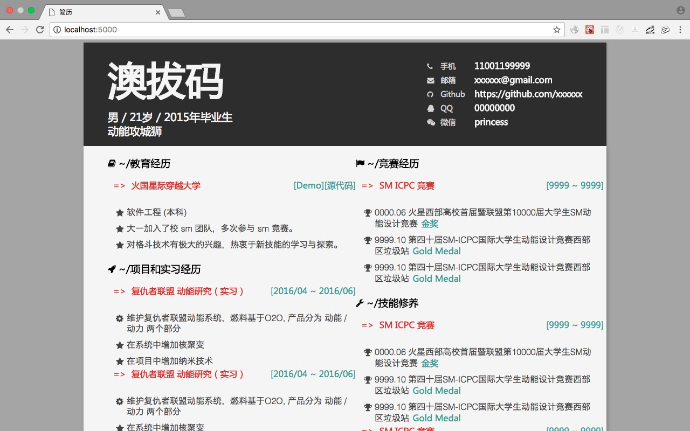

# react-resume-generator

### How To Use
**step 1**: `npm install`

**step 2**: `npm run start`

**step 3**: modify `src/data/template.json`

### what is this project about?
This is a resume generator is based on react, the resume is drawn by `src/data/template.json`
you can modify the 'template.json' to update the resume

you can also run `npm run build` to produce a `/dist` file, so you can put the `/dist` file in your 
blog system
